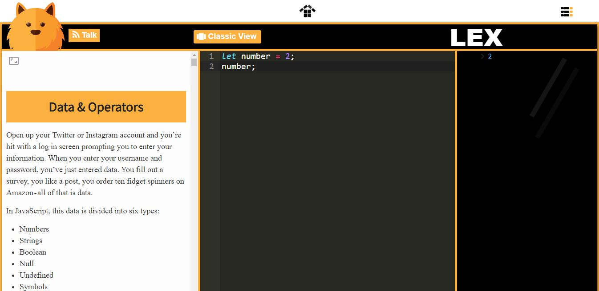
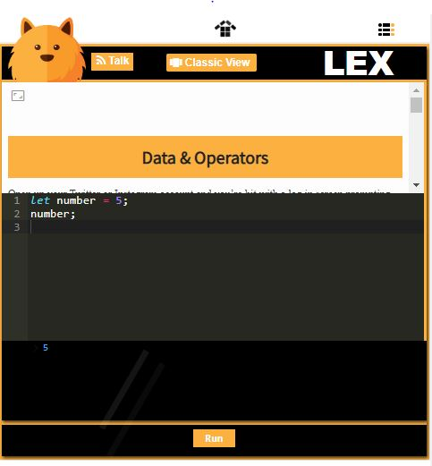
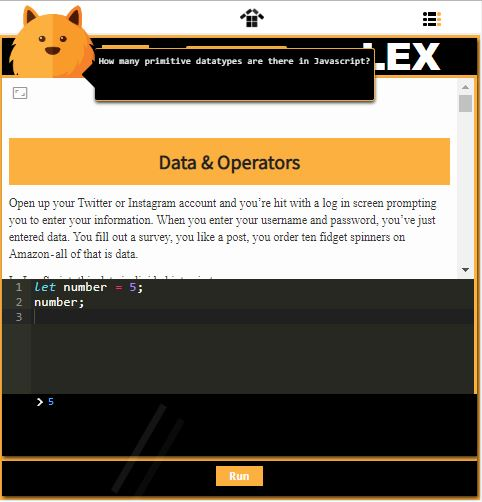
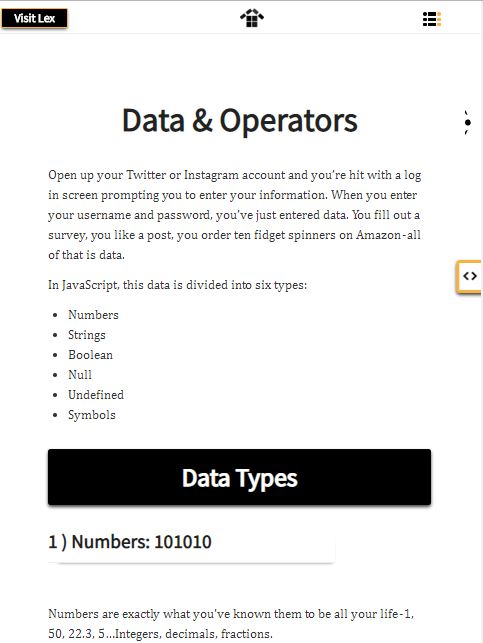
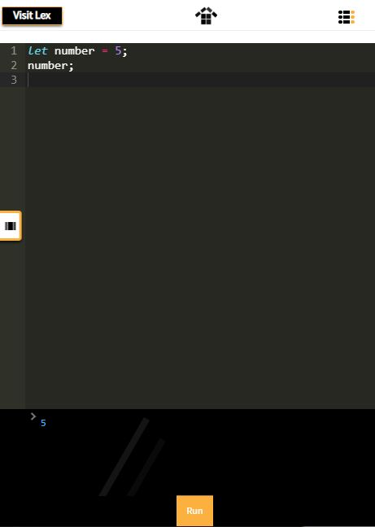

What drives How To Code JS is a tool dubbed Lex. I designed the sandbox to make learning to code fun and engaging. The compiler I used to interpret the JavaScript is an old tool called JS-Interpreter. I retrofitted it with Babel to enable one to code in ES6. 

Lex is fully responsive, making it the perfect repl for those who prefer to learn to code on the go.

If you want to get a better view of the text, simply click the semi-transparent window icon on the top left corner.

If you want to get Lex to talk, click talk and he'll quiz you. Watch out though--he's a struggling comedian.

If you ever get tired of Lex, simply go to classic view to get a full view of the lesson.

You can then toggle to the dev environment to practise the skills you've learned.

